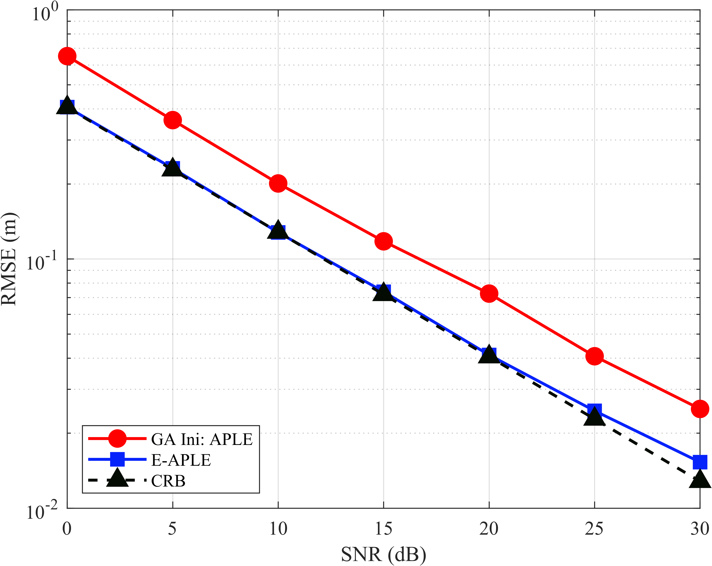

# APLE / E-APLE algorithm for Near-field localization
 ==This is not my paper, but if you think this helps you please cite my paper== 
 ```
M. Cheng, R. Wang, W. Peng and G. Zheng, “Precoding with Linear-Scaling
Complexity in Massive MIMO DFRC Systems,” *IEEE Transactions on Vehicular
Technology*, doi: [10.1109/TVT.2026.3693709](https://doi.org/10.1109/TVT.2026.3693709).
```

```bibtex
@ARTICLE{cheng2026,
  author={Cheng, Mingfeng and Wang, Ruoxu and Peng, Wei and Zheng, Gan},
  journal={IEEE Transactions on Vehicular Technology},
  title={Precoding with Linear-Scaling Complexity in Massive MIMO DFRC Systems},
  year={2026},
  volume={},
  number={},
  pages={1-6},
  doi={10.1109/TVT.2026.3693709}
}
```

This is a reproduction of  
`Scalable near-field localization based on partitioned large-scale antenna array`  
 APLE / E-APLE algorithms.




## Layout

- `APLE/`: `estimate_aple`, the direct two-dimensional Eq. (18)-(23)
  variational AoA posterior, and APLE-only VM functions. The supplied
  `VALSE.m` is retained as a reference only and is not called by APLE.
- `E-APLE/`: exact profile ML, E-APLE BCA, and GA Ini: APLE.
- `optional/`: array coordinates, partitioning, spherical steering, snapshot generation, and CRB.
- `results/`: MAT outputs generated by the runner.
- `RMSEvsSNR.m`: direct experiment entry script.
- `draw.m`: sectioned plotting/diagnostic script.

## Run an experiment

Open `RMSEvsSNR.m` and edit the parameter block at the top. In particular,
change `MC` to choose the number of Monte Carlo trials and change
`outputName` for a new result file. Then run:

```matlab
cd release/CODE
RMSEvsSNR
```

Each trial uses one exact spherical-wave observation. GA Ini: APLE and
E-APLE share the same observation, noise, truth, and APLE initialization.
The algorithm RMSE is `sqrt(mean(norm(pTrue-pHat)^2))`; the CRB curve is
`sqrt(mean(trace(CRB_position)))`. Existing MAT files are not silently
overwritten: MATLAB prints a warning before replacing the selected name.

The default runner uses `parfor` over trials with `numWorkers = 6`. Set
`useParallel = false` for serial debugging, or change `numWorkers` in the
parameter block.

The MAT output is summary-only: it stores configuration, three RMSE curves,
APLE initial RMSE, mean squared errors, success rates, and CRB valid/failed
counts. Per-trial observations, estimates, and optimization histories are not
saved, keeping result files small.

For a quick smoke test, set `RELEASE_SMOKE_MC=1` in the workspace and run
`RMSEvsSNR`; the script then uses one trial without changing its normal
parameter block.

## Plot existing results

Run `draw.m`. Its MATLAB `%%` sections independently load a MAT file, draw
the three semilog RMSE curves, draw APLE initial error, and show one trial's
objective and parameter trajectories. Figures are displayed only. Each
section contains a commented `exportgraphics` example that can be uncommented
when a figure should be saved.
